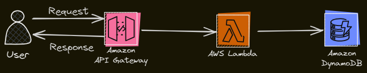

# Rest-API-AWS

## Description
This project aims to create a RESTful API hosted on AWS API Gateway, utilizing AWS Lambda for backend processing and DynamoDB for data storage. The API will perform CRUD (Create, Read, Update, Delete) operations on a DynamoDB table that stores information about various travel destinations. The infrastructure is managed using Terraform for Infrastructure as Code (IaC).

## Features
- **GET**: Retrieve all travel destinations.
- **POST**: Add a new travel destination.

## Technologies Used
- **AWS API Gateway**: For hosting the API.
- **AWS Lambda**: For backend processing.
- **AWS DynamoDB**: For data storage.
- **boto3**: AWS SDK for Python to interact with DynamoDB.
- **Terraform**: For managing and deploying infrastructure.

## Architecture Diagram
